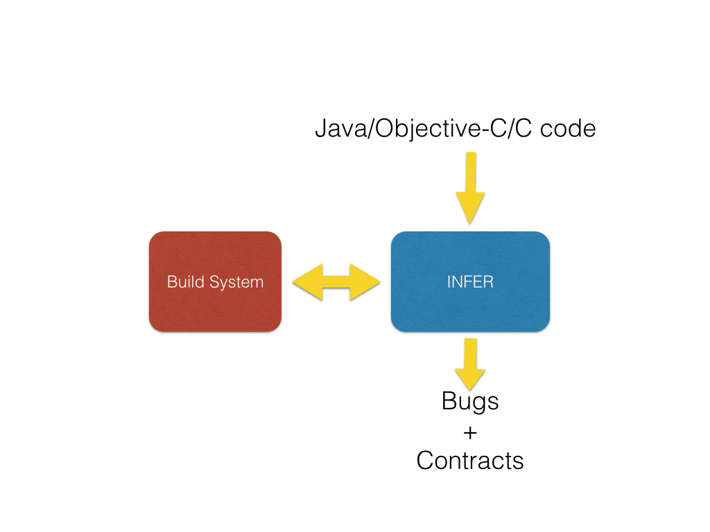

## What is Infer?

Infer is a static analyzer based on recent research
in program verification developed at Facebook.
It is used as part of the Facebook development process, where
it runs on
code modifications submitted for mobile apps;
these include the main Facebook apps for Android and iOS, Facebook Messenger, Instagram, and other apps which are used by over a billion people in total.
Each month, hundreds of potential bugs are reported by Infer and fixed by Facebook developers,
before they are committed and shipped to peoples' phones.

If you give Infer an input program, it produces a list of potential bugs.

At present, Infer reports null pointer exceptions and resource leaks for Android and Java code, and additionally memory leaks for iOS and C. These are some of the more important error-types on mobile apps.
Infer's capabilities will be extended as it's further developed.

##Using Infer

Start with the <a href="docs/getting-started.html">Getting Started</a> guide to download and try Infer yourself. Infer is open-source, so you can also start with the code on the <a href="https://github.com/facebook/Infer">GitHub repo</a>.

Infer is still evolving, and we want to continue to develop it in the open.

We hope it will be useful for other projects, so please try it out or contribute to it, join the community and give us feedback!
