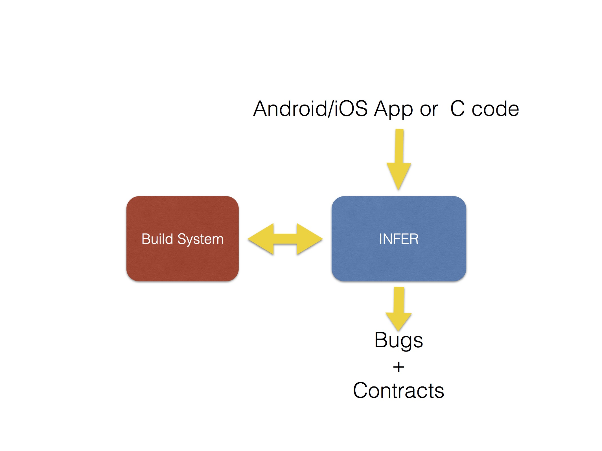

##What is Infer?

Infer is a static analyzer, designed to find bugs in Java and C projects and Objective-C.
If you give it input code Infer creates a list of potential bugs as well as contracts it finds during
the analysis.

Infer is in deployment inside Facebook,
where we use it to improve the quality of our mobile apps.
Every
day there are hundreds of
code diffs submitted to our mobile code bases,
including the main Facebook apps for Android and iOS,
Facebook Messenger, Instagram, and other apps which are used by over a billion people in total.
Infer runs in our data centers
as part of our continuous integration system,
where it verifies select properties of these code
modification in our mobile apps.

We are releasing binaries of Infer for use with
Linux or MacOs.
You can run it on your local machine to view
the results.
We are also releasing the source code for
people who wish to contribute to or study it.

At present, Infer reports
null pointer exceptions and resource leaks for Android and Java code, and additionally memory leaks for
iOS and C.
These are some of the more important error-types
on mobile apps. We will be extending Infer's capabilities as we develop it further.

##Using Infer

Start with our <a href="/docs/getting-started.html">Getting Started</a> guide to download and
try Infer yourself. Infer is open-source, so you can also start with the code on the <a href="https://github.com/facebook/Infer">GitHub repo</a>.

Infer is still evolving, and
we
want to continue to develop it in the open.
We hope it will be useful for other projects, so
please try it out or contribute to it, join the community and give us feedback!
